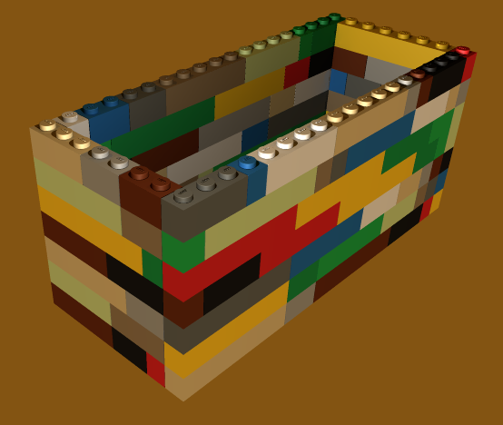
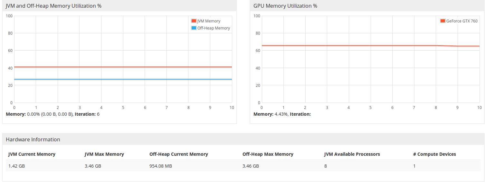
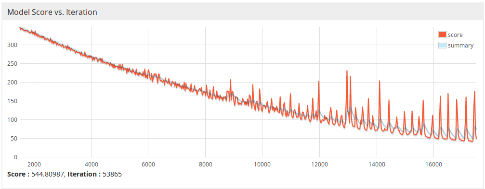
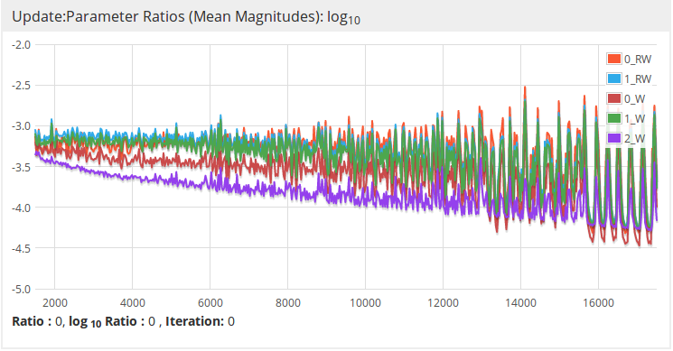
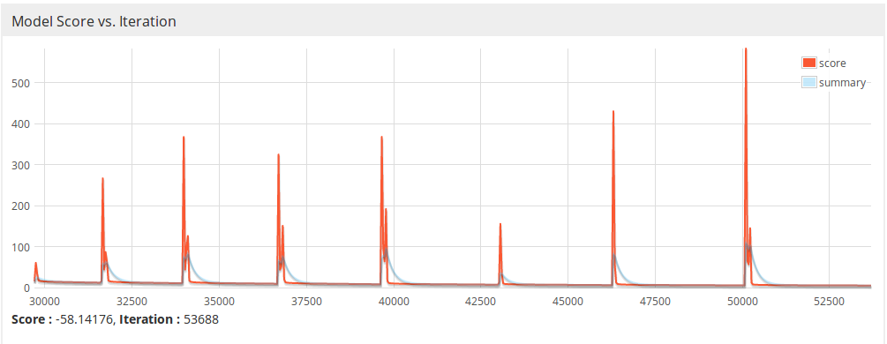
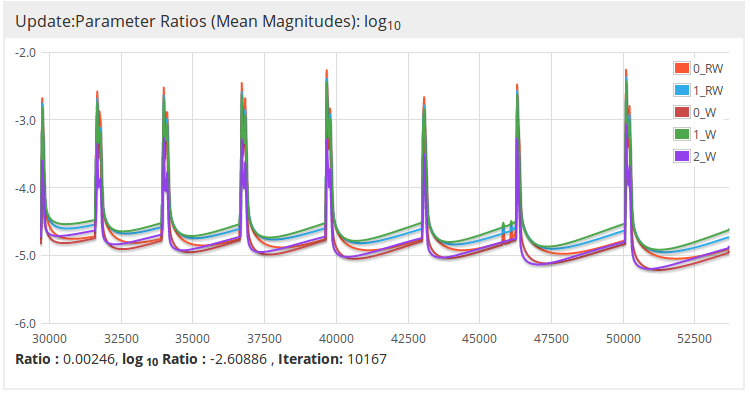
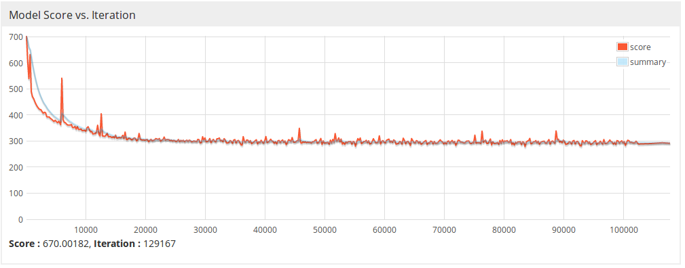
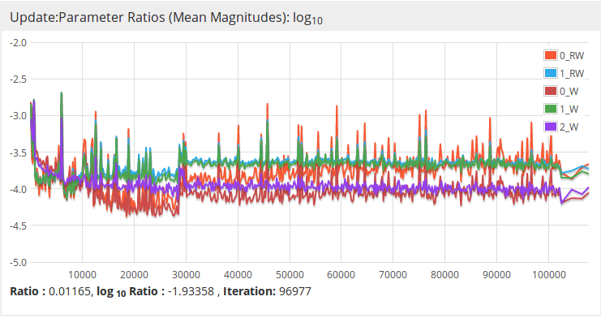
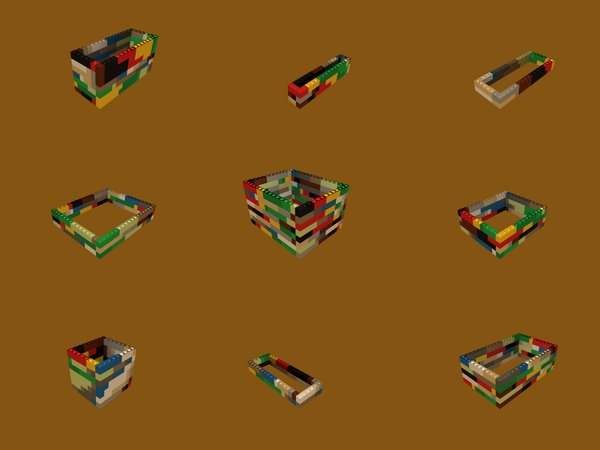

# lego-builder

## Problem definition

Given an unrestrited set of straight bricks of different lengths and 1 unit height and width, I would like to have
a model that, when asked, generates a building, that matches following conditions:
 * it consists of at least one outline
 * all outlines are of the same shape, likely rectangular
 * outlines are stacked on each other
 * was not seen previously by the model
 
 

> Note: as the conditions are fabricated, it's easy to solve the problem with random generator and set of building rules, however 
the intention was to learn RNN architecture and deep networks in more details, given some simple problem

## Data at hand

As I had no list of such buildings I decided to generate it. There's a generator that for the rectangular shape of given maximum
wall lengths generates set of correctly constructed buildings.

Every building consists of outlines and every outline cosists of bricks. Brick holds information about:
 * position in 3D space
 * length
 * direction (4 possible values: north, east, west, south)
 
 There's domain layer that represents bricks and outlines in object oriented way. In order to use such data as an input to the model, is encoded in the following way:
 ```
 brickEncoded = 100 + brick.length * 4 + directionToInteger(brick.direction)
 ```
 As an example `Brick(3, NORTH)` is `113` and `Brick(1, WEST)` is `106`. When put in sequence, `113, 106, 110` gives `Brick(<0, 0, 0>, 3, NORTH), Brick(<0, 0, 3>, 1, WEST), Brick(<-1, 0, 3>, 2, WEST)`.
 
 There are 3 special values:
 * 0 - next outline, move one level (y) up
 * 1 - end of the building, no more outlines out there
 * -1 - nothing
 
## Selecting network architecture

I picked [RNN](https://www.coursera.org/lecture/nlp-sequence-models/recurrent-neural-network-model-ftkzt) to tackle the problem. Encoded building was treated as a list of discrete values that was transformed with one-hot-encoding and passed as a sequence into network input layer. For every brick, the next in sequence was given as a label.

Network consisted of set of [LSTM layers](https://www.coursera.org/lecture/nlp-sequence-models/long-short-term-memory-lstm-KXoay). I followed [RNN hints](https://towardsdatascience.com/rnn-training-tips-and-tricks-2bf687e67527) and was adapting size of the network to the input train sets sizes.

At first, I treated one building as one input record. I had to find the building that requires the biggest number of bricks. I padded all building to this number, filling the paddings with `-1`. This naive approach didn't turn into good results. `-1`s have dominated the input heavily, with almost 60% provided values. As a result, output buildings were often of small height as `-1` was frequently picked.

```
113, 106, 110, ..., -1, -1, -1, -1, -1, -1, -1, [...], -1
```

In the second approach, encoded buildings where glued one after another. This resulted in better stability of training and better loss drop. Still, network struggled to construct buildings correctly and these were not at the highest quality.

```
113, 106, 110, ..., 104, 109, 1, 112, 107, ..., 106, 1, 104, 106
```

My conclusion was that since the input is still aligned to maximum number of 220 bricks, input record splits the first and last building in two parts. That gave network wrong information how the sequences of bricks should follow one after another.

As the final approach, I modified the second approach by adding padding when I knew that I cannot input the building without splitting it into 2 parts. This way, the record always contained complete, correctly formed building and there was no domination of single values.

```
113, 106, 110, ..., 104, 109, 1, 112, 107, ..., 106, 1, -1, -1
```

This form of data gave the best results in terms of frequency of correctly constructed buildings.

In order to feed encoded building into the network, I used one-hot encoding. 

## Training model

As one building was encoded on average to 100 values then 1,000 of buildings encoded to 100,000 values. If compared to sentences in classical [sampling of novel sequences problem](https://www.coursera.org/lecture/nlp-sequence-models/sampling-novel-sequences-MACos), setting up 1,000 buildings could be compared to 55 page novel.

Following [hints regarding size](https://towardsdatascience.com/rnn-training-tips-and-tricks-2bf687e67527), I adapted size of the layers to training set size.

### Hardware note

I was quite unsure if it makes sense to train deep netoworks with my desktop machine. Firstly I tried training with my CPU which is [AMD FX-8500](https://cpubenchmark.net/cpu.php?cpu=AMD+FX-8350+Eight-Core&id=1780) and 16GB RAM. I was able to fit all data into memory even for the biggest network configurations (~100 million parameters). Using CPU turned out to be very slow though - iteration of 64 buildings in batch took ~15 of seconds. 

In contrary when I used [GeForce GTX-760 2GB](https://www.videocardbenchmark.net/gpu.php?gpu=geforce+gtx+760&id=2561) with [cuDNN](https://developer.nvidia.com/cudnn) computation was boosted ~100 times. The downside though was that networks with more than 20 million parameters didn't fit into card memory.


 
### Starting with the small train set

In order to avoid [common RNN pitfalls](https://blog.slavv.com/37-reasons-why-your-neural-network-is-not-working-4020854bd607)
I decided to start training with a very small set of 10 buildings and very small network. I was able to train this network quickly, but also overfitted to this small input set. Such network was able to only generate exact same buildings that it has
seen before.

Since this model overfit to such small input data the next step was to use more data, scaling network configuration accordingly. 

### Increasing train set size

The next train set contained 500 buildings. It took considerably longer time to find suitable network configuration and train it to sensible loss value.

The configuration was about 2 LSTM layers followed by RNN output layer with softmax activation. 

```java
MultiLayerConfiguration conf = new NeuralNetConfiguration.Builder()
                .cacheMode(CacheMode.DEVICE)
                .weightInit(WeightInit.XAVIER)
                .updater(new Adam(0.0005))
                .list()
                .layer(0, new LSTM.Builder().nIn(27).nOut(128)
                        .activation(Activation.TANH).build())
                .layer(1, new LSTM.Builder().nIn(128).nOut(128)
                        .activation(Activation.TANH).build())
                .layer(2, new RnnOutputLayer.Builder(LossFunctions.LossFunction.MCXENT)
                        .activation(Activation.SOFTMAX)
                        .nIn(128).nOut(27)
                        .build())
                .backpropType(BackpropType.TruncatedBPTT)
                        .tBPTTForwardLength(220)
                        .tBPTTBackwardLength(220)
                .build();
```

There were nearly 220,000 network parameters and the training set was about 100,000 characters, so it felt like a sufficient number to conduct the training. 



Although model score had nice slope, there were some peeks that could mean:
 * too big learning rate
 * instability in computation causing exploding gradients
 * loss function having very sharp edges
 
 
 
High variation in update of the parameters could mean instabilities, but zooming into the very last epochs gave strong suspicion that from time to time updater steps out from the local minima due to the not well adapted learning rate and falls back to it after some iterations.

 | 

Reducing learning rate though resulted in convergence happening too soon.

Network generated correct building in 97% cases, so almost every time when asked, but only 1.5% is unique, so very small fraction.

### Final train set

The final train set size was 25,000 buildings. The network configuration was as following:

```java
MultiLayerConfiguration conf = new NeuralNetConfiguration.Builder()
                .cacheMode(CacheMode.DEVICE)
                .weightInit(WeightInit.XAVIER)
                .updater(new Adam(0.0005))
                .list()
                .layer(0, new LSTM.Builder().nIn(27).nOut(512)
                        .activation(Activation.TANH).build())
                .layer(1, new LSTM.Builder().nIn(512).nOut(256)
                        .activation(Activation.TANH).build())
                .layer(2, new RnnOutputLayer.Builder(LossFunctions.LossFunction.MCXENT)
                        .activation(Activation.SOFTMAX)
                        .nIn(256).nOut(27)
                        .build())
                .backpropType(BackpropType.TruncatedBPTT)
                        .tBPTTForwardLength(220)
                        .tBPTTBackwardLength(220)
                .build();
```

 | 

Loss value converged quite soon, at the fairly high value. Also parameter update ratios was not optimal, however network started exposing interesting capabilities. It was generating correct building in 70% of the cases and only 2% were seen previously by the model.

## Summary & conclusions



It was interesting to see that network not only learned to create outlines of correct shape, but also knows how to create another levels of building of the same shape.

I learned the following during this exercise:
* experimenting with different network configurations requires discipline, as it's easy to loose track of which approach was already tried
* good toolbox helps conducting experiments and tracking the results
* I could have saved so match time with proper hyperparameter tuning
* GPU training is far more time effective to CPU training
* more GPU memory is a must when training bigger models, something worth considering when matching hardware to solution
* RNN architectures are computationally intensive
* adjusting data format is a key factor, when stucked it's worth spending more time on data wrangling instead of modelling
* looking into network internals during training gives insight into the loss not dropping or fluctuating violently
* starting small is a good idea
* if loss converges, improvement exponentially drops with time - I wasn't patient enought to verify if I reached saddle point, but could be worth trying
* keeping end goal in mind is important, loss is not everything to take into account
