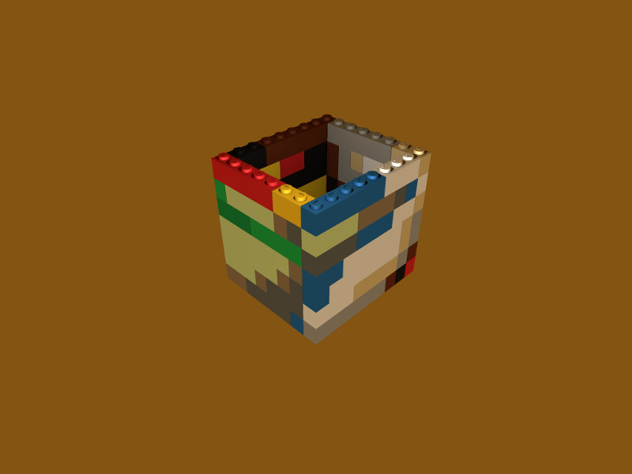
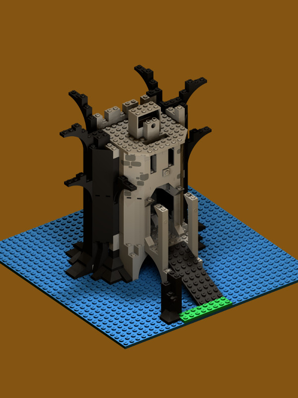
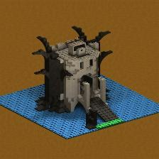
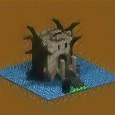
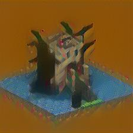
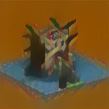

# bricks color transfer

This project is a [clone](https://github.com/deeplearning4j/dl4j-examples/blob/master/dl4j-examples/src/main/java/org/deeplearning4j/examples/styletransfer/NeuralStyleTransfer.java)

The following image is used for style:

The following is used for content:

I was wondering if black & grey castle will receive colors. I ran 1,000 iterations. Most of the impact happens before 300th interation.

 0   25   50 
 100   200   300 
-
The overal algorithm is as follows:
1. load pretrained VGG16 model from network and cache locally
1. load content image, mix it with random noise - that's called combination
1. for every conv layer compute gram matrix (flat version of activations multiplicated by transposition) for style
1. feedforward combination
1. backpropagate style
    * derivative loss style in layer - style gram matrix with activations on combination
    * backpropagate data from Gatys through vgg16 style layers
1. backpropagate content
    * derivative loss contet in layer - content gram matrix with activations on combination
    * backpropagate data from Gatys through vgg16  all layers
1. weight sum backpropagation output from content and style
1. apply updater straight onto these values
1. update combination with values
1. logging of loss
    1. calculate total style loss - style and combination sum of squared errors on every style layer
    1. calculate content loss - combination and content sum of squared errors
1. reiterate feedworward combination
